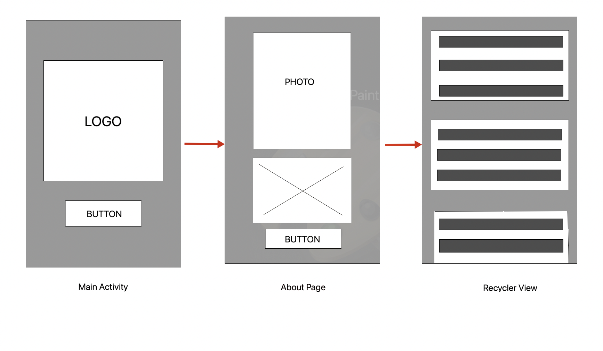
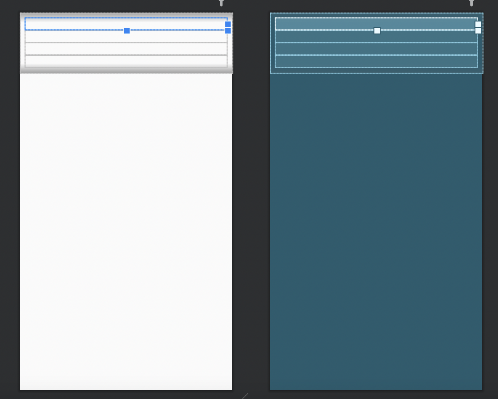
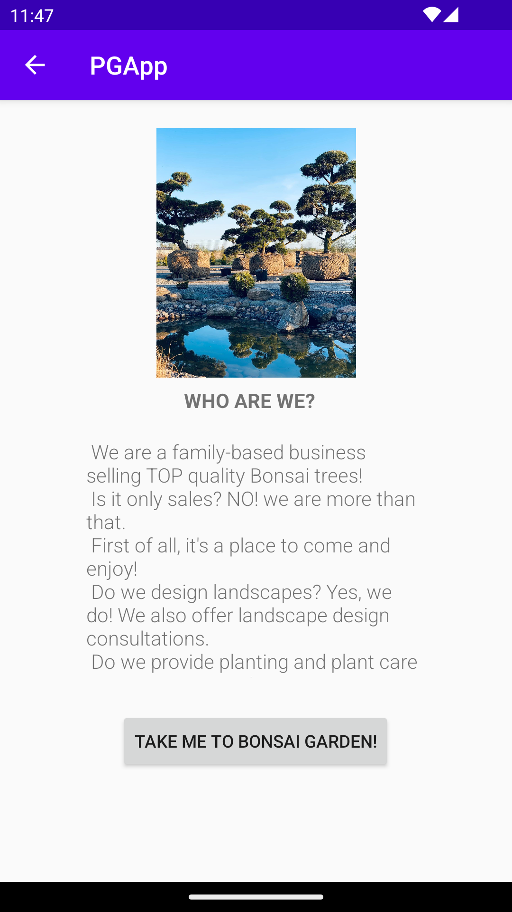

# PGApp

#About the Project Prestige Garden Studio 

This project is based on my friends business company which sells Bonsai trees.
The idea for the app is to show main page as a welcome screen with the button "Explore" 
which takes the user to About page where business owner present the main activities of their company.
This is the skis of an idea:



App presents data of the Bonsai trees with JSON-data from the university web. This line of the code
(Figure 1) is in the RecyclerActivity:
Figure 1.
```
private final String JSON_URL = "https://mobprog.webug.se/json-api?login=a22vioja";
```

#JSON FILE

This is en example of an object from the Bonsai class.(Figure 2) There are 6 atributes all together in Json 
file: Name, ID, Size, Cost, Category and login. Name attribute is the name of the Bonsai tree - 
for example “Watereri”. ID is the unik value for every tree, for example "Bonsai1". Size is 
implemented as a tree height, för example: "150" cm. Cost is the price for the tree - "20 000" kr 
and the category is the type of the tree - for this example it is "Pinus Sylvestris".

Figure 2
```
public class Bonsai {
    @SerializedName("Name")
    public String name;
    @SerializedName("ID")
    public String id;
    @SerializedName("Size")
    public String height;
    @SerializedName("Cost")
    public int price;
    @SerializedName("Category")
    public String category;

    public Bonsai(String name, String id, String height, int price, String category) {
        this.name = name;
        this.id = id;
        this.height = height;
        this.price = price;
        this.category = category;
    }
```

#IMPLEMENTATIONS EXAMPLE

I created recycler_view_item xml file for the one Bonsai tree to be shown on the screen. One item
includes the information about name, category, height and price(Figure 3).

Figure 3
```
<TextView
        android:id="@+id/name"
        android:layout_width="match_parent"
        android:layout_height="wrap_content"
        android:textSize="18sp" />

    <TextView
        android:id="@+id/category"
        android:layout_width="match_parent"
        android:layout_height="wrap_content"
        android:textSize="18sp" />

    <TextView
        android:id="@+id/height"
        android:layout_width="match_parent"
        android:layout_height="wrap_content"
        android:textSize="18sp" />

    <TextView
        android:id="@+id/price"
        android:layout_width="match_parent"
        android:layout_height="wrap_content"
        android:textSize="18sp" />

```


This is the link to the relevant commit: 
https://github.com/a22vioja/PGApp/commit/420d9b16468e0358251dab6f8cbdab7dfcb66a6d 

I created About page activity for the description of the business and presentation of the services it 
provides(Figure 4).

Figure 4
```
public class AboutPage extends AppCompatActivity {

    @Override
    protected void onCreate(Bundle savedInstanceState) {
        super.onCreate(savedInstanceState);
        setContentView(R.layout.activity_about_page);

    }
}
```
It also includes XML file which provides the view for the app(Figure 5):

Figure 5
```
<TextView
        android:id="@+id/textView2"
        android:layout_width="116dp"
        android:layout_height="41dp"
        android:text="WHO ARE WE?"
        android:textSize="16sp"
        android:textStyle="bold"
        app:layout_constraintBottom_toTopOf="@+id/textView"
        app:layout_constraintEnd_toEndOf="parent"
        app:layout_constraintStart_toStartOf="parent" />

    <ImageView
        android:id="@+id/imageView3"
        android:layout_width="223dp"
        android:layout_height="200dp"
        app:layout_constraintBottom_toTopOf="@+id/textView2"
        app:layout_constraintEnd_toEndOf="parent"
        app:layout_constraintStart_toStartOf="parent"
        app:layout_constraintTop_toTopOf="parent"
        app:layout_constraintVertical_bias="0.764"
        app:srcCompat="@drawable/_80206811_5344780035573434_404496635289364981_n" />

```
This is the link to the relevant commit:
https://github.com/a22vioja/PGApp/commit/8e246d8235120e1b2f7a4e0e80711f40bc27381a


This is the code implementation for the Button from About page to the Recycler Activity. (Figure 6) 
I create Intent to initiate communication between different classes(screens):

Figure 6
```
Button button= findViewById(R.id.button);
        button.setOnClickListener(new View.OnClickListener() {
            public void onClick(View view) {
                
                Intent intent = new Intent(AboutPage.this, RecyclerActivity.class);
                startActivity(intent);
            }
        });
```

Here is an XML file part for the button(Figure 7):

Figure 7
```
<Button
        android:id="@+id/button"
        android:layout_width="wrap_content"
        android:layout_height="wrap_content"
        android:text="TAKE ME TO BONSAI GARDEN!"
        app:layout_constraintBottom_toBottomOf="parent"
        app:layout_constraintEnd_toEndOf="parent"
        app:layout_constraintHorizontal_bias="0.498"
        app:layout_constraintStart_toStartOf="parent"
        app:layout_constraintTop_toBottomOf="@+id/textView"
        app:layout_constraintVertical_bias="0.232" />
```

This is the link to the relevant commit:
https://github.com/a22vioja/PGApp/commit/9edd0433ff1efe7aee2400ad1b0ba9925b411e76 

This is the About Page screen:



This is the implementation of MyAdapter class and Recycler view:
```
```

This is the link to the relevant commit:


